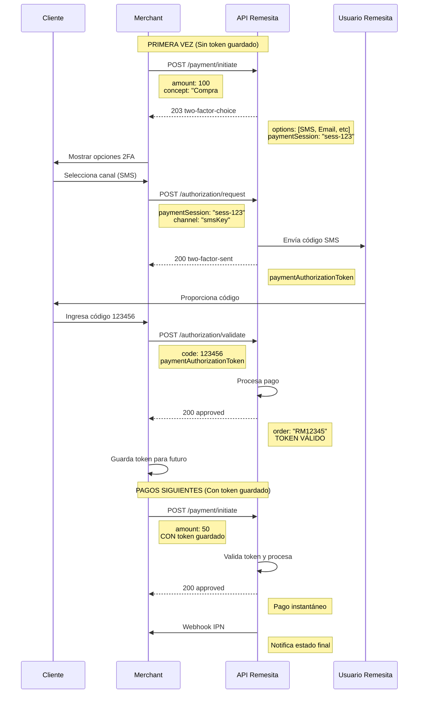

# Caso de Uso 1: Pago Simple a Wallet del Comercio

## 📋 Descripción

Este es el flujo más básico donde un comercio cobra un monto y los fondos caen directamente en la wallet asociada al business. Es ideal para:

- Ventas de productos/servicios
- Pagos únicos
- Transacciones simples sin intermediarios

## 🔄 Diagrama de Flujo



## 💻 Ejemplo de Integración - PHP SDK

### Servicio de Pago

```php
<?php

  
```
 

## 🔑 Puntos Clave

1. **Guardar el Token**: Una vez validado, guarda el `paymentAuthorizationToken` asociado al cliente
2. **Reutilizar Token**: En pagos futuros, envía el token guardado para procesamiento instantáneo
3. **Manejo de Errores**: Implementa reintentos y manejo adecuado de errores de red
4. **Webhooks**: Siempre implementa el endpoint IPN para confirmación definitiva del pago
5. **Seguridad**: Valida las firmas de los webhooks según documentación de Remesita
6. **Expiración**: Los tokens tienen validez temporal, maneja la renovación cuando expiren
7. **Límites**: Ten en cuenta los límites por nivel de cliente (diarios/mensuales)
