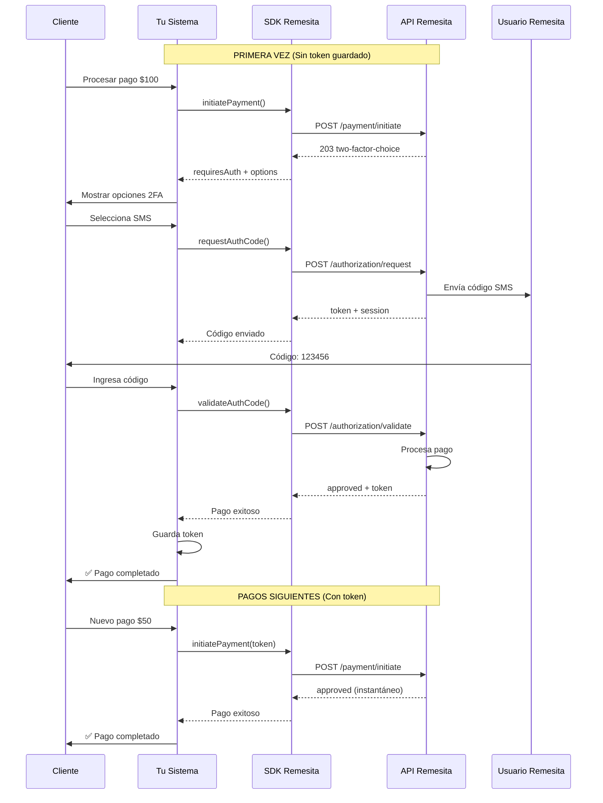

# Caso de Uso 1: Pago Simple a Wallet del Comercio

## 📋 Descripción

Flujo básico donde un comercio cobra un monto y los fondos caen directamente en la wallet del negocio.

**Ideal para:**
- Ventas de productos/servicios
- Pagos únicos
- E-commerce tradicional
- Transacciones sin intermediarios

## 🔄 Diagrama de Flujo



## 💻 Instalación del SDK

### Composer

```bash
composer require remesita/php-sdk
```

O añade a tu `composer.json`:

```json
{
    "require": {
        "remesita/php-sdk": "^1.0"
    }
}
```

## 🚀 Implementación

### 1. Configuración Inicial

```php
<?php

use Remesita\SDK\RemesitaClient;

// Inicializar el SDK
$remesita = new RemesitaPaymentAutorizationFlowClient(
    apiToken: $_ENV['REMESITA_API_TOKEN'],
    businessUnitId: $_ENV['REMESITA_BUSINESS_ID']
);
```

### 2. Procesar un Pago (Primera Vez - Sin Token)

```php
<?php

// Datos del pago
$orderId = 'ORDER-12345';
$amount = 100.00;
$customerAccount = '+1234567890'; // o wallet address

// Buscar si ya tenemos un token guardado
$customer = $customerRepository->findByAccount($customerAccount);
$savedToken = $customer?->getRemesitaToken();

try {
    $result = $remesita->initiatePayment([
        'amount' => $amount,
        'account' => $customerAccount,
        'concept' => "Compra en TiendaXYZ - Orden #{$orderId}",
        'savedToken' => $savedToken,
        'customId' => $orderId,
        'ipnUrl' => 'https://mitienda.com/webhook/remesita',
        'feeAssumedBy' => 'payer' // o 'collector'
    ]);

    // CASO 1: Pago procesado (tenía token válido)
    if ($result['status'] === 'approved') {
        return [
            'success' => true,
            'message' => 'Pago procesado exitosamente',
            'orderReference' => $result['order']
        ];
    }

    // CASO 2: Requiere autorización 2FA
    if ($result['status'] === 'two-factor-choice') {
        // Guardar en sesión
        $_SESSION['paymentSession'] = $result['paymentSession'];
        $_SESSION['customerAccount'] = $customerAccount;
        
        return [
            'requiresAuth' => true,
            'authOptions' => $result['options'], // [SMS, Email, WhatsApp, etc]
            'paymentSession' => $result['paymentSession']
        ];
    }

} catch (RemesitaException $e) {
    return [
        'success' => false,
        'error' => $e->getMessage()
    ];
}
```

### 3. Solicitar Código de Autorización

```php
<?php

// El usuario seleccionó un canal (ej: SMS)
$channelId = $_POST['channelId']; // ID recibido en authOptions
$paymentSession = $_SESSION['paymentSession'];

try {
    $result = $remesita->requestAuthCode($paymentSession, $channelId);
    
    // Guardar el token de autorización
    $_SESSION['authToken'] = $result['paymentAuthorizationToken'];
    
    return [
        'success' => true,
        'message' => 'Código enviado. Revisa tu ' . ($channelId === 'sms' ? 'SMS' : 'correo')
    ];
    
} catch (RemesitaException $e) {
    return ['error' => $e->getMessage()];
}
```

### 4. Validar Código y Completar Pago

```php
<?php

// El usuario ingresó el código
$code = $_POST['code'];
$paymentSession = $_SESSION['paymentSession'];
$authToken = $_SESSION['authToken'];
$customerAccount = $_SESSION['customerAccount'];

try {
    $result = $remesita->validateAuthCode($paymentSession, $authToken, $code);
    
    if ($result['status'] === 'approved') {
        // ✅ PAGO EXITOSO
        
        // Guardar el token para futuros pagos
        $customer = $customerRepository->findByAccount($customerAccount);
        $customer->setRemesitaToken($result['paymentAuthorizationToken']);
        $customerRepository->save($customer);
        
        // Limpiar sesión
        unset($_SESSION['paymentSession'], $_SESSION['authToken']);
        
        return [
            'success' => true,
            'message' => 'Pago procesado exitosamente',
            'orderReference' => $result['order']
        ];
    }
    
    return ['error' => $result['error'] ?? 'Error en la validación'];
    
} catch (RemesitaException $e) {
    return ['error' => $e->getMessage()];
}
```

### 5. Webhook (IPN) - Confirmación Final

```php
<?php

// POST /webhook/remesita
$payload = json_decode(file_get_contents('php://input'), true);

// TODO: Verificar firma del webhook según documentación

$orderId = $payload['custom_id'];
$status = $payload['status'];
$reference = $payload['ref'];

$order = $orderRepository->find($orderId);

if ($order) {
    switch ($status) {
        case 'paid':
        case 'completed':
            $order->setStatus('paid');
            $order->setRemesitaReference($reference);
            $order->setPaidAt(new DateTime($payload['paid_at']));
            break;
            
        case 'cancelled':
            $order->setStatus('cancelled');
            $order->setCancelReason($payload['cancel_reason']);
            break;
    }
    
    $orderRepository->save($order);
}

http_response_code(200);
echo 'OK';
```

## 📱 Ejemplo Frontend (JavaScript)

### HTML

```html
<div id="payment-form">
    <h3>Total a pagar: $<span id="amount">100.00</span></h3>
    
    <!-- Paso 1: Seleccionar canal 2FA (si es necesario) -->
    <div id="auth-options" style="display:none;">
        <h4>Autoriza el pago:</h4>
        <div id="channels"></div>
    </div>
    
    <!-- Paso 2: Ingresar código -->
    <div id="code-input" style="display:none;">
        <input type="text" id="auth-code" placeholder="Código de 6 dígitos">
        <button onclick="validateCode()">Verificar</button>
    </div>
    
    <button id="pay-btn" onclick="initPayment()">Pagar Ahora</button>
</div>
```

### JavaScript

```javascript
async function initPayment() {
    const response = await fetch('/checkout/pay', {
        method: 'POST',
        headers: { 'Content-Type': 'application/json' },
        body: JSON.stringify({
            orderId: 'ORDER-123',
            amount: 100,
            customerAccount: '+1234567890'
        })
    });
    
    const result = await response.json();
    
    if (result.success) {
        // Pago procesado inmediatamente (tenía token)
        showSuccess(result.message);
        return;
    }
    
    if (result.requiresAuth) {
        // Mostrar opciones de autorización
        showAuthOptions(result.authOptions, result.paymentSession);
    }
}

function showAuthOptions(options, session) {
    window.paymentSession = session;
    
    const container = document.getElementById('channels');
    container.innerHTML = options.map(opt => 
        `<button onclick="requestCode('${opt.value}')">${opt.label}</button>`
    ).join('');
    
    document.getElementById('auth-options').style.display = 'block';
}

async function requestCode(channelId) {
    const response = await fetch('/checkout/request-code', {
        method: 'POST',
        headers: { 'Content-Type': 'application/json' },
        body: JSON.stringify({ channelId })
    });
    
    const result = await response.json();
    
    if (result.success) {
        document.getElementById('code-input').style.display = 'block';
        alert('Código enviado. Por favor revisa tu dispositivo.');
    }
}

async function validateCode() {
    const code = document.getElementById('auth-code').value;
    
    const response = await fetch('/checkout/validate-code', {
        method: 'POST',
        headers: { 'Content-Type': 'application/json' },
        body: JSON.stringify({ code })
    });
    
    const result = await response.json();
    
    if (result.success) {
        showSuccess(result.message);
    } else {
        alert(result.error);
    }
}

function showSuccess(message) {
    document.getElementById('payment-form').innerHTML = 
        `<div class="success">✅ ${message}</div>`;
}
```

## 🔑 Puntos Clave

### ✅ Ventajas del Token Guardado

1. **Primera vez**: Requiere autorización 2FA (~30 segundos)
2. **Siguientes pagos**: Instantáneos (< 1 segundo)
3. **Experiencia**: Igual que Amazon 1-Click

### 🔒 Seguridad

- Los tokens expiran automáticamente
- El usuario puede revocar tokens desde su perfil
- Cada token está asociado a un negocio específico
- 2FA obligatorio para el primer pago

### 💡 Mejores Prácticas

1. **Siempre implementa el webhook IPN** para confirmación definitiva
2. **Guarda el token** asociado al cliente para pagos futuros
3. **Maneja errores** de red y tokens expirados
4. **Muestra claramente** el concepto del pago al usuario
5. **Valida** que el monto en el webhook coincida con tu orden

### ⚠️ Manejo de Errores Comunes

```php
<?php

try {
    $result = $remesita->initiatePayment([...]);
} catch (RemesitaException $e) {
    // Errores comunes:
    // - "payment session expired": Reiniciar flujo
    // - "Invalid authorization code": Permitir reintentos (máx 5)
    // - "Insufficient funds": Informar al cliente
    // - "Token expired": Solicitar nueva autorización
}
```

## 📊 Códigos de Estado

| Estado | Significado | Acción |
|--------|-------------|--------|
| `approved` | Pago exitoso | Entregar producto |
| `processing` | En proceso | Esperar webhook |
| `two-factor-choice` | Requiere auth | Mostrar opciones |
| `failed` | Error | Mostrar mensaje |
| `cancelled` | Cancelado | Liberar inventario |

## 🔗 Recursos

- [Documentación completa del SDK](https://docs.remesita.com/sdk)
- [Ejemplos en GitHub](https://github.com/remesita/php-sdk-examples)
- [Webhook IPN Format](https://remesita.com/samples/IpnPayload.json)
