# Caso de Uso 2: Pago con Distribución entre Múltiples Wallets

## 📋 Descripción

Cobra un monto y distribuye automáticamente los fondos entre múltiples wallets sin costos adicionales.

**Ideal para:**
- 🛒 Marketplaces (vendedor + comisión plataforma)
- 🤝 Plataformas multi-vendor
- 💰 Sistemas de afiliados
- 👥 Reparto automático entre socios
- 📊 Modelos de negocio con comisionistas

**Ventaja clave:** La distribución es **instantánea** y **sin fee adicional**

## 🔄 Diagrama de Flujo

```mermaid
sequenceDiagram
    participant Cliente
    participant Marketplace
    participant SDK
    participant API Remesita
    participant Wallet Vendedor
    participant Wallet Afiliado
    participant Wallet Marketplace
    
    Note over Marketplace: Cliente compra $100<br/>Vendedor: $70<br/>Afiliado: 10% = $10<br/>Marketplace: $20
    
    Cliente->>Marketplace: Pagar $100
    Marketplace->>SDK: initiatePayment()<br/>+ distribution
    SDK->>SDK: Valida distribución<br/>70 + 10 ≤ 100 ✓
    SDK->>API Remesita: POST /payment/initiate
    
    API Remesita->>API Remesita: Cobra $100 del cliente
    
    Note over API Remesita: Distribución automática
    
    par Transferencias simultáneas
        API Remesita->>Wallet Vendedor: $70
        API Remesita->>Wallet Afiliado: $10
        API Remesita->>Wallet Marketplace: $20 (resto)
    end
    
    API Remesita-->>SDK: approved
    SDK-->>Marketplace: Pago + distribución OK
    Marketplace->>Cliente: ✅ Compra exitosa
    
    API Remesita->>Marketplace: Webhook IPN<br/>con detalle distribución
```



## 💰 Tipos de Distribución

### 1. Monto Fijo

```php
[
    'account' => 'wallet-vendedor-123',
    'fixed_amount' => 70.00
]
```

### 2. Porcentaje

```php
[
    'account' => 'wallet-afiliado-456',
    'percentage_amount' => 10 // 10% del total
]
```

### 3. Combinado

```php
// De un pago de $100:
// - Vendedor recibe $70 (fijo)
// - Afiliado recibe 10% = $10
// - Marketplace recibe el resto = $20

$distribution = [
    [
        'account' => 'wallet-vendedor',
        'fixed_amount' => 70.00
    ],
    [
        'account' => 'wallet-afiliado',
        'percentage_amount' => 10
    ]
    // Marketplace automáticamente recibe: $100 - $70 - $10 = $20
];
```

## 🚀 Implementación

### Configuración

```php
<?php

use Remesita\SDK\RemesitaPaymentAutorizationFlowClient;

$remesita = new RemesitaPaymentAutorizationFlowClient(
    apiToken: $_ENV['REMESITA_API_TOKEN'],
    businessUnitId: $_ENV['REMESITA_BUSINESS_ID']
);
```

### Ejemplo 1: Marketplace Simple

```php
<?php

// Datos de la venta
$orderId = 'MKT-12345';
$totalAmount = 100.00;
$customerAccount = '+1234567890';

// Obtener detalles de la orden
$order = $orderRepository->find($orderId);

// Configurar distribución
$distribution = [
    [
        'account' => $order->getVendor()->getWalletAddress(),
        'fixed_amount' => 70.00 // El vendedor recibe $70
    ],
    [
        'account' => $order->getAffiliate()->getWalletAddress(),
        'percentage_amount' => 10 // Afiliado recibe 10% = $10
    ]
    // Marketplace recibe automáticamente el resto: $20
];

// Calcular cuánto recibirá el marketplace
$marketplaceAmount = $remesita->calculateMerchantAmount($totalAmount, $distribution);
echo "Marketplace recibirá: $" . $marketplaceAmount; // $20.00

// Buscar token guardado
$customer = $customerRepository->findByAccount($customerAccount);
$savedToken = $customer?->getRemesitaToken();

try {
    $result = $remesita->initiatePayment([
        'amount' => $totalAmount,
        'account' => $customerAccount,
        'concept' => "Compra en Marketplace - Orden #{$orderId}",
        'distribution' => $distribution,
        'savedToken' => $savedToken,
        'customId' => $orderId,
        'ipnUrl' => 'https://marketplace.com/webhook/remesita',
        'feeAssumedBy' => 'payer'
    ]);

    if ($result['status'] === 'approved') {
        // ✅ Pago y distribución exitosos
        return [
            'success' => true,
            'message' => 'Pago procesado y distribuido',
            'orderReference' => $result['order'],
            'breakdown' => $result['breakdown']
        ];
    }

    if ($result['status'] === 'two-factor-choice') {
        // Requiere autorización (mismo flujo del caso 1)
        return [
            'requiresAuth' => true,
            'authOptions' => $result['options'],
            'paymentSession' => $result['paymentSession']
        ];
    }

} catch (RemesitaException $e) {
    return ['error' => $e->getMessage()];
}
```

### Ejemplo 2: Sistema de Comisiones Multi-nivel

```php
<?php

// Venta de $200 con múltiples comisionistas
$saleAmount = 200.00;

$distribution = [
    // Vendedor principal: $140 (70%)
    [
        'account' => 'wallet-vendedor-principal',
        'fixed_amount' => 140.00
    ],
    // Afiliado nivel 1: 8% = $16
    [
        'account' => 'wallet-afiliado-1',
        'percentage_amount' => 8
    ],
    // Afiliado nivel 2: 5% = $10
    [
        'account' => 'wallet-afiliado-2',
        'percentage_amount' => 5
    ],
    // Referido: 3% = $6
    [
        'account' => 'wallet-referido',
        'percentage_amount' => 3
    ]
    // Plataforma recibe: $200 - $140 - $16 - $10 - $6 = $28
];

// Validar antes de enviar
try {
    $platformAmount = $remesita->calculateMerchantAmount($saleAmount, $distribution);
    
    echo "Distribución:\n";
    echo "- Vendedor: $140.00\n";
    echo "- Afiliado 1: $16.00 (8%)\n";
    echo "- Afiliado 2: $10.00 (5%)\n";
    echo "- Referido: $6.00 (3%)\n";
    echo "- Plataforma: $" . $platformAmount . "\n";
    
    $result = $remesita->initiatePayment([
        'amount' => $saleAmount,
        'account' => $customerAccount,
        'concept' => 'Venta multinivel',
        'distribution' => $distribution,
        'savedToken' => $savedToken,
        'customId' => $orderId,
        'ipnUrl' => 'https://plataforma.com/webhook'
    ]);
    
} catch (RemesitaException $e) {
    echo "Error: " . $e->getMessage();
}
```

### Ejemplo 3: Modelo 50/50 entre Socios

```php
<?php

// Negocio con 2 socios que se reparten todo 50/50
$revenue = 500.00;

$distribution = [
    [
        'account' => 'wallet-socio-1',
        'percentage_amount' => 50 // 50% = $250
    ],
    [
        'account' => 'wallet-socio-2',
        'percentage_amount' => 50 // 50% = $250
    ]
    // En este caso, la cuenta del negocio NO recibe nada
];

$result = $remesita->initiatePayment([
    'amount' => $revenue,
    'account' => $customerAccount,
    'concept' => 'Servicio consultoria',
    'distribution' => $distribution,
    'savedToken' => $savedToken,
    'customId' => $orderId
]);
```

### Ejemplo 4: Marketplace con Fee Variable

```php
<?php

// El fee del marketplace varía según la categoría del producto
function getMarketplaceFeePercentage($category) {
    return match($category) {
        'electronics' => 15,
        'fashion' => 20,
        'books' => 10,
        default => 12
    };
}

$order = $orderRepository->find($orderId);
$feePercent = getMarketplaceFeePercentage($order->getCategory());
$vendorPercent = 100 - $feePercent;

$distribution = [
    [
        'account' => $order->getVendor()->getWalletAddress(),
        'percentage_amount' => $vendorPercent
    ]
    // Marketplace recibe el porcentaje restante automáticamente
];

echo "Vendedor recibirá: {$vendorPercent}%\n";
echo "Marketplace recibirá: {$feePercent}%\n";

$result = $remesita->initiatePayment([
    'amount' => $order->getTotal(),
    'account' => $customerAccount,
    'concept' => "Orden #{$order->getId()} - {$order->getCategory()}",
    'distribution' => $distribution,
    'savedToken' => $savedToken,
    'customId' => $orderId
]);
```

## 🎯 Validaciones Automáticas del SDK

El SDK valida la distribución antes de enviarla:

```php
<?php

// ❌ ESTO FALLARÁ
$distribution = [
    ['account' => 'wallet-1', 'percentage_amount' => 60],
    ['account' => 'wallet-2', 'percentage_amount' => 50]
    // Total: 110% > 100% ❌
];

try {
    $result = $remesita->initiatePayment([
        'amount' => 100,
        'distribution' => $distribution,
        // ...
    ]);
} catch (RemesitaException $e) {
    echo $e->getMessage(); 
    // "La suma de porcentajes no puede exceder 100%"
}

// ❌ ESTO TAMBIÉN FALLARÁ
$distribution = [
    ['account' => 'wallet-1', 'fixed_amount' => 80],
    ['account' => 'wallet-2', 'fixed_amount' => 30]
    // Total: $110 > $100 ❌
];

try {
    $result = $remesita->initiatePayment([
        'amount' => 100,
        'distribution' => $distribution,
        // ...
    ]);
} catch (RemesitaException $e) {
    echo $e->getMessage(); 
    // "La distribución total (110) excede el monto a cobrar (100)"
}
```

## 📨 Webhook con Información de Distribución

```php
<?php

// POST /webhook/remesita
$payload = json_decode(file_get_contents('php://input'), true);

if ($payload['status'] === 'completed') {
    $orderId = $payload['custom_id'];
    $distribution = $payload['distribution'] ?? [];
    
    // Actualizar registro de comisiones
    foreach ($distribution as $item) {
        $commissionRepository->create([
            'order_id' => $orderId,
            'wallet' => $item['account'],
            'amount' => $item['amount'],
            'type' => $item['type'], // 'fixed' o 'percentage'
            'paid_at' => new DateTime()
        ]);
    }
    
    // Log para auditoría
    logger()->info("Distribución completada", [
        'order' => $orderId,
        'total_distributed' => array_sum(array_column($distribution, 'amount')),
        'recipients' => count($distribution)
    ]);
}

http_response_code(200);
echo 'OK';
```

## 🔧 Utilidades del SDK

### Calcular Distribución Antes de Cobrar

```php
<?php

// Útil para mostrar preview al vendedor antes de confirmar
$totalSale = 150.00;
$distribution = [
    ['account' => 'wallet-vendor', 'fixed_amount' => 100],
    ['account' => 'wallet-affiliate', 'percentage_amount' => 10]
];

$merchantAmount = $remesita->calculateMerchantAmount($totalSale, $distribution);

echo "Preview de distribución:\n";
echo "- Total venta: $" . $totalSale . "\n";
echo "- Vendedor: $100.00\n";
echo "- Afiliado: $" . ($totalSale * 0.10) . " (10%)\n";
echo "- Tú recibes: $" . $merchantAmount . "\n";
```

### Distribución Dinámica por Reglas de Negocio

```php
<?php

class DistributionCalculator
{
    private RemesitaClient $remesita;
    
    public function calculateForOrder(Order $order): array
    {
        $total = $order->getTotal();
        $distribution = [];
        
        // Vendedor recibe su parte
        $vendorAmount = $order->getVendorAmount();
        $distribution[] = [
            'account' => $order->getVendor()->getWalletAddress(),
            'fixed_amount' => $vendorAmount
        ];
        
        // Si hay afiliado, recibe su comisión
        if ($order->hasAffiliate()) {
            $distribution[] = [
                'account' => $order->getAffiliate()->getWalletAddress(),
                'percentage_amount' => $order->getAffiliateCommissionPercent()
            ];
        }
        
        // Si es primera compra del cliente, bonus al vendedor
        if ($order->isFirstPurchaseFromCustomer()) {
            $distribution[] = [
                'account' => $order->getVendor()->getWalletAddress(),
                'fixed_amount' => 5.00 // Bonus $5
            ];
        }
        
        return $distribution;
    }
}

// Uso
$calculator = new DistributionCalculator($remesita);
$distribution = $calculator->calculateForOrder($order);

$result = $remesita->initiatePayment([
    'amount' => $order->getTotal(),
    'account' => $customerAccount,
    'concept' => "Orden #{$order->getId()}",
    'distribution' => $distribution,
    'savedToken' => $savedToken
]);
```

## ⚠️ Limitaciones y Consideraciones

### ✅ Permitido

- Hasta 10 destinatarios diferentes
- Combinar montos fijos y porcentajes
- Porcentajes con hasta 2 decimales (ej: 12.50%)
- Distribución parcial (no es obligatorio distribuir el 100%)

### ❌ No Permitido

- Suma de porcentajes > 100%
- Suma total distribución > monto cobrado
- Cuentas inválidas o inexistentes
- Montos negativos

### 💡 Mejores Prácticas

1. **Validar antes**: Usa `calculateMerchantAmount()` para preview
2. **Logs detallados**: Registra cada distribución para auditoría
3. **Manejo de errores**: La distribución falla si alguna wallet no existe
4. **Testing**: Prueba con cuentas sandbox antes de producción
5. **Transparencia**: Muestra al cliente el desglose si es necesario

## 📊 Comparación con Métodos Tradicionales

| Método | Costo | Tiempo | Complejidad |
|--------|-------|--------|-------------|
| **Distribución Remesita** | $0 | Instantáneo | 1 llamada API |
| Transferencias manuales | Fee × N | Minutos/Horas | N llamadas |
| Batch processing | Fee × N | Diario | Sistema custom |
| Cuenta escrow | Fee + % | 24-72h | Legal complejo |

## 🔗 Recursos

- [Documentación SDK completa](https://docs.remesita.com/sdk)
- [Ejemplos marketplace](https://github.com/remesita/marketplace-example)
- [Calculadora de comisiones](https://remesita.com/tools/commission-calculator)
