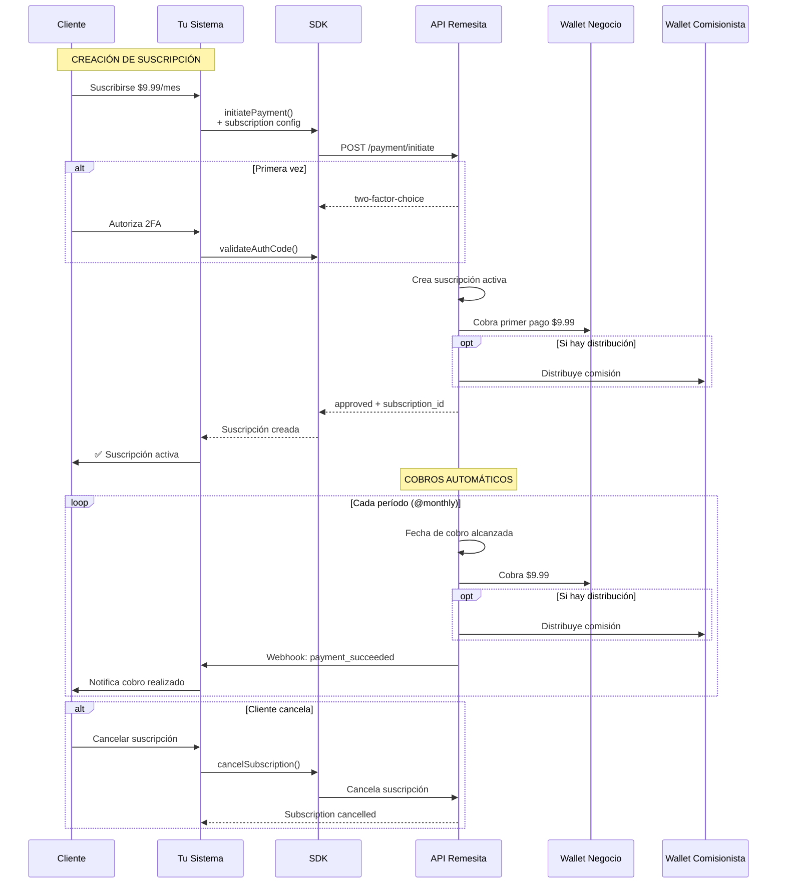

# Caso de Uso 3: Pagos Recurrentes (Suscripciones)

## 📋 Descripción

Crea suscripciones con cobros automáticos recurrentes. Opcionalmente puede incluir distribución automática a otras wallets.

**Ideal para:**
- 📺 Servicios de streaming
- 💪 Membresías de gimnasios
- 📰 Suscripciones de contenido
- 🎓 Plataformas educativas
- 💼 SaaS y servicios por suscripción
- 🛡️ Seguros y servicios de protección

**Ventaja clave:** Cobros automáticos sin intervención manual + distribución opcional

## 🔄 Diagrama de Flujo



## 📅 Frecuencias Disponibles

| Frecuencia | Ejemplo |
|------------|---------|
| `@daily` | Todos los días |
| `@weekly` | Cada semana |
| `@monthly` | Cada mes (mismo día) |
| `@yearly` | Cada año |
| `@quarterly` | Cada 3 meses |
| `@biweekly` | Cada 2 semanas |

## 🚀 Implementación

### Configuración

```php
<?php

use Remesita\SDK\RemesitaPaymentAutorizationFlowClient;

$remesita = new RemesitaPaymentAutorizationFlowClient(
    apiToken: $_ENV['REMESITA_API_TOKEN'],
    businessUnitId: $_ENV['REMESITA_BUSINESS_ID']
);
```

### Ejemplo 1: Suscripción Básica Mensual

```php
<?php

// Netflix-style: $9.99/mes indefinidamente
$customerAccount = '+1234567890';

// Buscar token guardado
$customer = $customerRepository->findByAccount($customerAccount);
$savedToken = $customer?->getRemesitaToken();

try {
    $result = $remesita->initiatePayment([
        'amount' => 9.99,
        'account' => $customerAccount,
        'concept' => 'Suscripción Premium StreamingApp',
        'savedToken' => $savedToken,
        'customId' => 'SUB-' . uniqid(),
        'ipnUrl' => 'https://miapp.com/webhook/subscription',
        'feeAssumedBy' => 'collector', // La plataforma asume el fee
        
        'subscription' => [
            'amount' => 9.99,
            'frequency' => '@monthly',
            'times' => -1, // Infinito (hasta que se cancele)
            'start' => date('Y-m-d'), // Empieza hoy
            'end' => date('Y-m-d', strtotime('+10 years')) // Fecha lejana
        ]
    ]);

    if ($result['status'] === 'approved') {
        // Guardar subscription_id para futuras referencias
        $subscriptionId = $result['subscription_id'];
        
        $subscriptionRepository->create([
            'customer_id' => $customer->getId(),
            'remesita_subscription_id' => $subscriptionId,
            'amount' => 9.99,
            'frequency' => 'monthly',
            'status' => 'active',
            'started_at' => new DateTime()
        ]);
        
        return [
            'success' => true,
            'message' => 'Suscripción creada. Serás cobrado $9.99 cada mes.',
            'subscriptionId' => $subscriptionId,
            'nextBillingDate' => date('Y-m-d', strtotime('+1 month'))
        ];
    }

    if ($result['status'] === 'two-factor-choice') {
        // Requiere autorización (mismo flujo del caso 1)
        $_SESSION['pendingSubscription'] = true;
        return [
            'requiresAuth' => true,
            'authOptions' => $result['options'],
            'paymentSession' => $result['paymentSession']
        ];
    }

} catch (RemesitaException $e) {
    return ['error' => $e->getMessage()];
}
```

### Ejemplo 2: Suscripción Limitada (12 meses)

```php
<?php

// Membresía anual dividida en 12 pagos
$annualPrice = 120.00; // $120/año
$monthlyPrice = $annualPrice / 12; // $10/mes

$result = $remesita->initiatePayment([
    'amount' => $monthlyPrice,
    'account' => $customerAccount,
    'concept' => 'Membresía Anual Gimnasio - Pago mensual',
    'savedToken' => $savedToken,
    'customId' => 'GYM-' . date('Y'),
    'ipnUrl' => 'https://gimnasio.com/webhook',
    
    'subscription' => [
        'amount' => $monthlyPrice,
        'frequency' => '@monthly',
        'times' => 12, // Solo 12 cobros
        'start' => date('Y-m-d'),
        'end' => date('Y-m-d', strtotime('+1 year'))
    ]
]);

// Después de 12 cobros, la suscripción se cancela automáticamente
```

### Ejemplo 3: Suscripción con Distribución (Afiliados)

```php
<?php

// Plataforma educativa: $29.99/mes
// - Instructor recibe 70% = $20.99
// - Afiliado recibe 10% = $3.00
// - Plataforma recibe 20% = $6.00

$subscriptionAmount = 29.99;

$distribution = [
    [
        'account' => $instructor->getWalletAddress(),
        'percentage_amount' => 70 // 70% para el instructor
    ],
    [
        'account' => $affiliate->getWalletAddress(),
        'percentage_amount' => 10 // 10% para afiliado
    ]
    // Plataforma recibe el 20% restante automáticamente
];

$result = $remesita->initiatePayment([
    'amount' => $subscriptionAmount,
    'account' => $customerAccount,
    'concept' => 'Curso de Programación - Suscripción Mensual',
    'savedToken' => $savedToken,
    'customId' => 'COURSE-' . $courseId,
    'ipnUrl' => 'https://academia.com/webhook',
    
    'subscription' => [
        'amount' => $subscriptionAmount,
        'frequency' => '@monthly',
        'times' => -1 // Hasta cancelar
    ],
    
    'distribution' => $distribution
]);

// Cada mes:
// - Se cobra $29.99 al estudiante
// - Instructor recibe $20.99 automáticamente
// - Afiliado recibe $3.00 automáticamente
// - Plataforma recibe $6.00 automáticamente
```

### Ejemplo 4: Trial + Suscripción

```php
<?php

// Ofrecer 7 días gratis, luego cobrar
function createTrialSubscription($customerAccount, $savedToken) {
    // Primero: Autorizar sin cobrar (amount = 0 en trial)
    $authResult = $remesita->initiatePayment([
        'amount' => 0, // No se cobra ahora
        'account' => $customerAccount,
        'concept' => 'Autorización SaaS Premium (Trial 7 días)',
        'savedToken' => $savedToken
        // NO incluimos 'subscription' todavía
    ]);
    
    if ($authResult['status'] === 'approved') {
        $token = $authResult['paymentAuthorizationToken'];
        
        // Guardar para cobrar después del trial
        $customerRepository->update($customer, [
            'trial_ends_at' => date('Y-m-d', strtotime('+7 days')),
            'remesita_token' => $token,
            'subscription_pending' => true
        ]);
        
        // Programar job para crear suscripción después del trial
        queue()->schedule(new CreateSubscriptionJob($customer), 
            now()->addDays(7)
        );
        
        return [
            'success' => true,
            'message' => 'Trial activado. En 7 días comenzará el cobro de $19.99/mes',
            'trialEnds' => date('Y-m-d', strtotime('+7 days'))
        ];
    }
}

// Job que se ejecuta después del trial
class CreateSubscriptionJob {
    public function handle($customer) {
        $result = $remesita->initiatePayment([
            'amount' => 19.99,
            'account' => $customer->getAccount(),
            'concept' => 'SaaS Premium - Suscripción Mensual',
            'savedToken' => $customer->getRemesitaToken(),
            
            'subscription' => [
                'amount' => 19.99,
                'frequency' => '@monthly',
                'times' => -1
            ]
        ]);
        
        if ($result['status'] === 'approved') {
            $customer->update([
                'subscription_active' => true,
                'subscription_id' => $result['subscription_id']
            ]);
            
            // Notificar al cliente
            Mail::send($customer, 'trial-ended-subscription-active');
        }
    }
}
```

### Ejemplo 5: Suscripción con Upgrades/Downgrades

```php
<?php

class SubscriptionManager {
    private RemesitaClient $remesita;
    
    public function upgradePlan($customer, $newPlan) {
        // Cancelar suscripción actual
        $this->cancelSubscription($customer->getSubscriptionId());
        
        // Crear nueva suscripción con el nuevo precio
        $result = $this->remesita->initiatePayment([
            'amount' => $newPlan->getPrice(),
            'account' => $customer->getAccount(),
            'concept' => "Upgrade a plan {$newPlan->getName()}",
            'savedToken' => $customer->getRemesitaToken(),
            
            'subscription' => [
                'amount' => $newPlan->getPrice(),
                'frequency' => '@monthly',
                'times' => -1
            ]
        ]);
        
        if ($result['status'] === 'approved') {
            $customer->update([
                'subscription_id' => $result['subscription_id'],
                'plan_id' => $newPlan->getId(),
                'upgraded_at' => new DateTime()
            ]);
            
            return ['success' => true, 'message' => 'Plan actualizado'];
        }
    }
    
    public function downgradePlan($customer, $newPlan) {
        // Similar al upgrade pero puede esperar al fin del período actual
        // No cancelamos inmediatamente, solo actualizamos para el próximo ciclo
        
        $customer->update([
            'pending_plan_change' => $newPlan->getId(),
            'plan_change_effective_date' => $this->getNextBillingDate($customer)
        ]);
        
        return [
            'success' => true,
            'message' => "Tu plan cambiará a {$newPlan->getName()} el próximo período"
        ];
    }
}
```

### Ejemplo 6: Suscripción Anual con Descuento

```php
<?php

// Plan mensual: $9.99/mes = $119.88/año
// Plan anual: $99/año (ahorro de $20.88)

$customerChoice = $_POST['billing_cycle']; // 'monthly' o 'yearly'

if ($customerChoice === 'monthly') {
    $result = $remesita->initiatePayment([
        'amount' => 9.99,
        'account' => $customerAccount,
        'concept' => 'Plan Premium - Facturación Mensual',
        'savedToken' => $savedToken,
        
        'subscription' => [
            'amount' => 9.99,
            'frequency' => '@monthly',
            'times' => -1
        ]
    ]);
} else {
    $result = $remesita->initiatePayment([
        'amount' => 99.00,
        'account' => $customerAccount,
        'concept' => 'Plan Premium - Facturación Anual (20% descuento)',
        'savedToken' => $savedToken,
        
        'subscription' => [
            'amount' => 99.00,
            'frequency' => '@yearly',
            'times' => -1
        ]
    ]);
}
```

## 📨 Webhooks de Suscripción

```php
<?php

// POST /webhook/subscription
$payload = json_decode(file_get_contents('php://input'), true);

$event = $payload['event'];
$subscriptionId = $payload['subscription_id'];
$customId = $payload['custom_id'];

switch ($event) {
    case 'subscription.payment.succeeded':
        // Cobro exitoso
        $subscription = $subscriptionRepository->findByRemesitaId($subscriptionId);
        $subscription->update([
            'last_payment_at' => new DateTime($payload['paid_at']),
            'next_billing_date' => new DateTime($payload['next_billing_date']),
            'payment_count' => $subscription->getPaymentCount() + 1
        ]);
        
        // Notificar al cliente
        Mail::send($subscription->getCustomer(), 'subscription-payment-success', [
            'amount' => $payload['amount'],
            'next_date' => $payload['next_billing_date']
        ]);
        break;
        
    case 'subscription.payment.failed':
        // Cobro fallido (fondos insuficientes, etc)
        $subscription = $subscriptionRepository->findByRemesitaId($subscriptionId);
        $subscription->update([
            'status' => 'past_due',
            'failed_payments' => $subscription->getFailedPayments() + 1
        ]);
        
        // Notificar al cliente para que actualice su método de pago
        Mail::send($subscription->getCustomer(), 'subscription-payment-failed', [
            'reason' => $payload['failure_reason'],
            'retry_date' => $payload['retry_date']
        ]);
        
        // Si han fallado 3 intentos, cancelar
        if ($subscription->getFailedPayments() >= 3) {
            $subscription->update(['status' => 'cancelled']);
            Mail::send($subscription->getCustomer(), 'subscription-cancelled');
        }
        break;
        
    case 'subscription.cancelled':
        // Suscripción cancelada
        $subscription = $subscriptionRepository->findByRemesitaId($subscriptionId);
        $subscription->update([
            'status' => 'cancelled',
            'cancelled_at' => new DateTime(),
            'cancellation_reason' => $payload['reason']
        ]);
        break;
        
    case 'subscription.completed':
        // Suscripción con 'times' limitado completó todos los pagos
        $subscription = $subscriptionRepository->findByRemesitaId($subscriptionId);
        $subscription->update([
            'status' => 'completed',
            'completed_at' => new DateTime()
        ]);
        
        // Ofrecer renovación
        Mail::send($subscription->getCustomer(), 'subscription-completed-renew');
        break;
}

http_response_code(200);
echo 'OK';
```

## 🛠️ Gestión de Suscripciones

### Cancelar Suscripción

```php
<?php

// El cliente cancela desde su perfil
public function cancelSubscription(Request $request) {
    $subscriptionId = $request->get('subscription_id');
    
    $subscription = $subscriptionRepository->find($subscriptionId);
    
    // Verificar que es el dueño
    if ($subscription->getCustomer()->getId() !== auth()->id()) {
        return ['error' => 'No autorizado'];
    }
    
    try {
        // Aquí necesitarías un endpoint adicional en el SDK
        // Por ahora, actualizamos localmente
        $subscription->update([
            'status' => 'pending_cancellation',
            'cancellation_requested_at' => new DateTime()
        ]);
        
        // La cancelación efectiva ocurre al final del período pagado
        return [
            'success' => true,
            'message' => 'Tu suscripción se cancelará el ' . 
                         $subscription->getNextBillingDate()->format('d/m/Y'),
            'access_until' => $subscription->getNextBillingDate()
        ];
        
    } catch (\Exception $e) {
        return ['error' => $e->getMessage()];
    }
}
```

### Pausar Suscripción (Feature Request)

```php
<?php

// Ejemplo conceptual - requeriría soporte de la API
public function pauseSubscription($subscriptionId, $resumeDate) {
    // Pausar por vacaciones, etc.
    $subscription = $subscriptionRepository->find($subscriptionId);
    
    $subscription->update([
        'status' => 'paused',
        'paused_at' => new DateTime(),
        'resume_at' => new DateTime($resumeDate)
    ]);
    
    // Programar job para reactivar
    queue()->schedule(
        new ResumeSubscriptionJob($subscription),
        new DateTime($resumeDate)
    );
}
```

## 📊 Dashboard de Suscripciones

```php
<?php

class SubscriptionDashboard {
    public function getMetrics() {
        return [
            'active_subscriptions' => $this->countActiveSubscriptions(),
            'monthly_recurring_revenue' => $this->calculateMRR(),
            'churn_rate' => $this->calculateChurnRate(),
            'average_lifetime_value' => $this->calculateLTV(),
            'failed_payments_this_month' => $this->countFailedPayments(),
            'upcoming_renewals' => $this->getUpcomingRenewals(30)
        ];
    }
    
    private function calculateMRR() {
        // Monthly Recurring Revenue
        return $subscriptionRepository
            ->where('status', 'active')
            ->where('frequency', 'monthly')
            ->sum('amount');
    }
    
    private function calculateChurnRate() {
        $startOfMonth = new DateTime('first day of this month');
        $activeAtStart = $subscriptionRepository
            ->where('created_at', '<', $startOfMonth)
            ->where('status', 'active')
            ->count();
            
        $cancelledThisMonth = $subscriptionRepository
            ->where('cancelled_at', '>=', $startOfMonth)
            ->count();
            
        return ($cancelledThisMonth / $activeAtStart) * 100;
    }
}
```

## ⚠️ Consideraciones Importantes

### ✅ Ventajas

- Cobros 100% automáticos
- Sin intervención manual
- Distribución automática incluida
- Webhooks para cada evento
- Reintentos automáticos en caso de fallo

### ⚠️ Limitaciones

- El cliente debe mantener fondos suficientes
- Después de 3 fallos consecutivos, se cancela automáticamente
- No se puede modificar el monto mid-cycle (requiere cancelar y crear nueva)
- Límites aplicables según nivel de cliente

### 💡 Mejores Prácticas

1. **Notifica antes del cobro**: Avisa 3-5 días antes
2. **Manejo de fallos**: Implementa retry logic y notificaciones
3. **Permite cancelación fácil**: No hagas difícil darse de baja
4. **Ofrece trials**: Aumenta conversión 30-40%
5. **Analytics**: Trackea MRR, churn rate, LTV
6. **Comunicación clara**: Muestra próxima fecha de cobro siempre visible
7. **Opciones de pago alternativas**: Ofrece anual con descuento

## 📈 Optimización de Conversión

```php
<?php

// Mostrar ahorro en plan anual
$monthlyPrice = 9.99;
$yearlyPrice = 99.00;
$yearlySavings = ($monthlyPrice * 12) - $yearlyPrice;
$savingsPercent = ($yearlySavings / ($monthlyPrice * 12)) * 100;

echo "Plan Mensual: \${$monthlyPrice}/mes\n";
echo "Plan Anual: \${$yearlyPrice}/año\n";
echo "Ahorra: \${$yearlySavings} ({$savingsPercent}%) con el plan anual!\n";

// Output:
// Plan Mensual: $9.99/mes
// Plan Anual: $99.00/año  
// Ahorra: $20.88 (17.4%) con el plan anual!
```

## 🔗 Recursos

- [Documentación completa del SDK](https://docs.remesita.com/sdk)
- [Ejemplos de suscripciones](https://github.com/remesita/subscription-examples)
- [Webhook events reference](https://docs.remesita.com/webhooks)
- [Dashboard analytics](https://remesita.com/dashboard/subscriptions)
